# Instalación y Configuración de AMBER en HPC CEDIA

Este documento describe el proceso para configurar el entorno de AMBER utilizando EnRoot en un sistema HPC de CEDIA.

## Requisitos Previos

- Acceso a un sistema HPC con soporte para EnRoot.
- Conexión a internet para descargar las dependencias.
- Permisos para instalar software dentro del contenedor.

## Pasos de Instalación

### 1. Configuración del Entorno EnRoot

1. **Importar la imagen base de Ubuntu**  
   ```bash
   enroot import docker://ubuntu:20.04 || { echo "Error al importar la imagen base de Ubuntu";}
   ```

2. **Crear un contenedor EnRoot desde la imagen importada**  
   ```bash
   enroot create --name ubuntu20.04 ubuntu+20.04.sqsh || { echo "Error al crear el contenedor EnRoot";}
   ```

3. **Verificar la lista de contenedores disponibles**  
   ```bash
   enroot list
   ```

4. **Iniciar el contenedor EnRoot en modo lectura/escritura**  
   ```bash
   enroot start --root --rw ubuntu20.04 || { echo "Error al iniciar el contenedor EnRoot";}
   ```

### 2. Configuración Dentro del Contenedor

1. **Actualizar la lista de paquetes y actualizar el sistema**  
   ```bash
   apt update && apt upgrade -y || { echo "Error al actualizar el sistema";}
   ```

2. **Instalar dependencias necesarias para AMBER**  
   ```bash
   apt-get install -y \
       cmake wget build-essential checkinstall \
       libncursesw5-dev libssl-dev libsqlite3-dev tk-dev \
       libgdbm-dev libc6-dev libbz2-dev libffi-dev zlib1g-dev \
       gfortran bison flex python-distutils-extra python-setuptools || { echo "Error al instalar dependencias";}
   ```

3. **Instalar Python 3**  
   ```bash
   apt install -y python3 || { echo "Error al instalar Python3";}
   ```

### 3. Instalación de Miniconda

1. **Descargar el instalador de Miniconda**  
   ```bash
   wget -q https://repo.anaconda.com/miniconda/Miniconda3-latest-Linux-x86_64.sh -O /tmp/Miniconda3-latest-Linux-x86_64.sh || { echo "Error al descargar Miniconda";}
   ```

2. **Instalar Miniconda de forma silenciosa**  
   ```bash
   bash /tmp/Miniconda3-latest-Linux-x86_64.sh -b -p "$HOME/miniconda" || { echo "Error al instalar Miniconda";}
   ```

3. **Configurar el PATH para incluir Miniconda**  
   ```bash
   export PATH="$HOME/miniconda/bin:$PATH"
   ```

### 4. Descarga e Instalación de AmberTools y Amber

1. **Cambiar al directorio temporal**  
   ```bash
   cd /tmp || { echo "Error al acceder al directorio /tmp";}
   ```

2. **Descargar AmberTools y Amber**  
   ```bash
   curl -X POST -d "Name=Juan Moromenacho" -d "Institution=UIDE" -o ambertools24.tar.gz https://ambermd.org/cgi-bin/AmberTools24-get.pl || { echo "Error al descargar AmberTools24";}
   curl -X POST -d "Name=Juan Moromenacho" -d "Institution=UIDE" -o amber24.tar.gz https://ambermd.org/cgi-bin/Amber24free-get.pl || { echo "Error al descargar Amber24";}
   ```

3. **Extraer los archivos descargados**  
   ```bash
   tar xvfj ambertools24.tar.bz2 || { echo "Error al extraer AmberTools24"}
   tar xvfj amber24.tar.bz2 || { echo "Error al extraer Amber24";}
   ```

### 5. Compilación de Amber

1. **Acceder al directorio de construcción**  
   ```bash
   cd amber24_src/build || { echo "Error al acceder al directorio de construcción";}
   ```

2. **Ejecutar el script de configuración**  
   ```bash
   ./run_cmake || { echo "Error al ejecutar run_cmake";}
   ```

3. **Compilar e instalar**  
   ```bash
   make install || { echo "Error al ejecutar make install";}
   ```

### 6. Configuración Final

1. **Configurar el entorno de AMBER**  
   ```bash
   source "$HOME/<User>/amber24/amber.sh" || { echo "Error al configurar el entorno AMBER";}
   ```

## Notas

- Asegúrate de reemplazar `<User>` con tu nombre de usuario en el sistema.
- Este script maneja errores comunes y muestra mensajes claros en caso de fallas.

# Diagrama del proceso AMBER en HPC CEDIA

Este diagrama describe los pasos para la configuración del entorno y la instalación de AMBER.

```mermaid
    graph TD
        subgraph Preparación del Ambiente
            A[Inicio del Script] --> B[Importar Imagen Base Ubuntu]
            B --> C[Crear Contenedor EnRoot desde Imagen]
            C --> D[Verificar Contenedores Disponibles]
            D --> E[Iniciar Contenedor EnRoot]
        end

        subgraph Configuración del Sistema Dentro del Contenedor
            E --> F[Actualizar Lista de Paquetes con apt update]
            F --> G[Actualizar Paquetes Existentes con apt upgrade]
            G --> H[Instalar Dependencias para AMBER]
            H --> I[Instalar Python3]
        end

        subgraph Instalación de Miniconda
            I --> J[Descargar Instalador Miniconda con wget]
            J --> K[Ejecutar Instalador Miniconda]
            K --> L[Configurar PATH para Miniconda]
        end

        subgraph Descarga de Archivos AMBER
            L --> M[Ir a Directorio /tmp]
            M --> N[Descargar AmberTools24 con curl]
            N --> O[Descargar Amber24 con curl]
            O --> P[Extraer AmberTools24.tar.bz2]
            P --> Q[Extraer Amber24.tar.bz2]
        end

        subgraph Compilación de AMBER
            Q --> R[Acceder al Directorio amber24_src/build]
            R --> S[Ejecutar Script ./run_cmake]
            S --> T[Compilar Código con make install]
        end

        subgraph Configuración Final
            T --> U[Configurar PATH para usar AMBER]
            U --> V[Fin del Script]
        end
```


