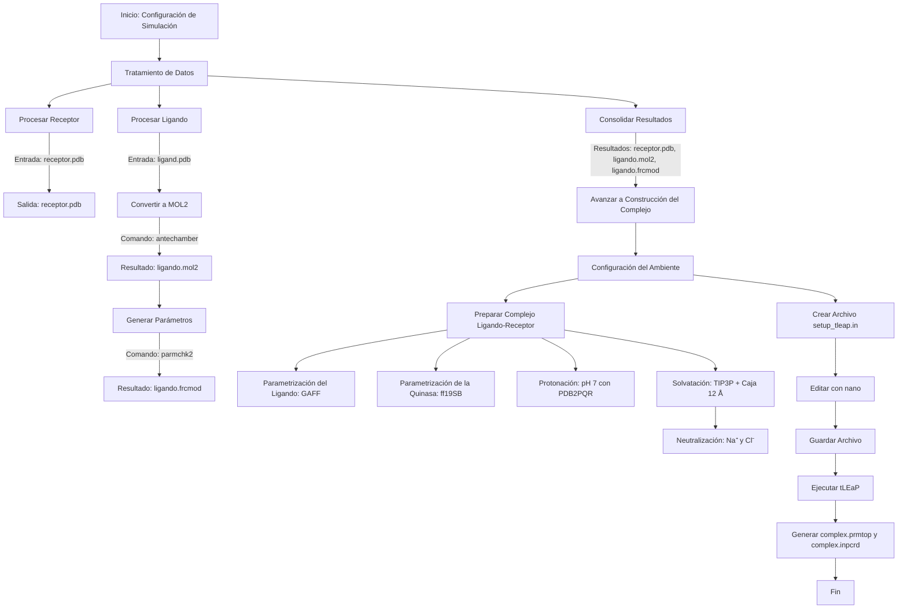
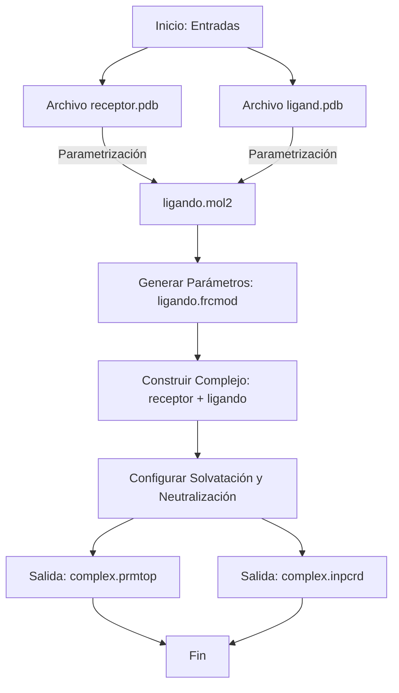

#  Etapa 1 (Configuracion de Simulacion LEaP)

## Descripccion


## Paso (Tratamiento de datos)

###  Tratamiento del Receptor
-   receptor.pdb
###  Tratamiento del Ligando   
-   ligand.pdb

Convertir el archivo PDB del ligando a formato MOL2:
   ```bash
   antechamber -i ligando.pdb -fi pdb -o ligando.mol2 -fo mol2 -c bcc -at gaff
   ```
Generar el archivo de parámetros del ligando:
   ```bash
    parmchk2 -i ligando.mol2 -f mol2 -o ligando.frcmod
   ```


###   Resultados del Tratamiento
-  ligando.mol2
-  ligando.frcmod
-  receptor.pdb

## Paso (Contruir Complejo de proteína-ligando)

###   Configuracion del Ambiente
Abrir un editor de texto: Usa cualquier editor de texto en tu sistema para crear el archivo. Por ejemplo:

###   Crear el archivo en Linux:
   ```bash
   nano setup_tleap.in
   ```

###   Informacion del ambiente
Preparación del complejo ligando-receptor

Parametrización del ligando:
-  Utilizar el módulo Antechamber de AMBER 20.
-  Aplicar el campo de fuerza GAFF (General Amber Force Field).

Parametrización de la quinasa (proteína):
-  Usar el campo de fuerza ff19SB de AMBER.

Estado de protonación:
-  Determinar el estado de protonación a pH fisiológico (pH = 7) utilizando PDB2PQR.

Solvatación del complejo:
-  Solvatación con moléculas de agua pre-equilibradas modelo TIP3P.
-  Configurar la caja de solvatación con una distancia de 12 Å.
-  Neutralizar el sistema añadiendo 6 Cl⁻ y ajustar la concentración salina a 0.15 M utilizando Na⁺ y Cl⁻.


###   Contenido en el archivo:

   ```bash
    source leaprc.protein.ff19SB
    source leaprc.gaff

    receptor = loadpdb receptor.pdb
    ligando = loadmol2 ligando.mol2
    loadamberparams ligando.frcmod

    complex = combine {receptor ligando}
    solvatebox complex TIP3PBOX 12.0
    addions complex Na+ 0
    addions complex Cl- 0

    saveamberparm complex complex.prmtop complex.inpcrd
    quit
   ```

## NOTAS
###   Diagrama


###   Diagrama  Entradas y Salida


###   Preguntas
-  ¿Qué es un .mol2?

Es un archivo que describe la estructura molecular en formato MOL2, incluyendo coordenadas atómicas y tipos de átomos.

-  ¿Por qué se necesitan los archivos de parámetros "ligando.mol2, ligando.frcmod, receptor.pdb"?

Estos archivos contienen las descripciones necesarias para realizar simulaciones con precisión.

-  ¿Qué es GAFF?

Es el "General Amber Force Field", un campo de fuerza general usado para moléculas orgánicas en AMBER.

-  ¿Por qué las moléculas de agua no son deseadas?
   
Algunas moléculas de agua pueden ser eliminadas durante la preparación para evitar solapamientos o redundancias en el modelo.

-  ¿Por qué ajustar los hidrógenos?
   
Para garantizar que las configuraciones de enlace y carga sean correctas en función del pH fisiológico.

-  ¿Qué herramienta se puede usar para ajustar los hidrógenos y las moléculas de agua?

PDB2PQR es una herramienta comúnmente usada para este propósito.

-  ¿Por qué configurar los parámetros físicos y químicos?

Para asegurar la estabilidad y realismo de la simulación en condiciones experimentales.

-  ¿Por qué usar un ambiente biológico pequeño?

Para reducir la complejidad computacional sin comprometer la precisión en el área de interés.

-  ¿Por qué usar un ambiente acuoso?

Un ambiente acuoso simula condiciones biológicas reales y asegura que las interacciones moleculares se comporten de manera fisiológicamente relevante.

-  ¿Además de TIP3PBOX, qué otros patrones existen?

Existen patrones como SPC/E, TIP4P, y otros modelos de agua con diferentes características para simulaciones específicas.

###   SCRIPT

   ```bash
      touch startLEaP.sh
   ```

   ```bash
      #!/bin/bash

      # Configuración inicial
      echo "Iniciando el proceso de configuración de simulación con AMBER..."

      # Verificar dependencias
      echo "Verificando herramientas requeridas..."
      command -v antechamber >/dev/null 2>&1 || { echo "Antechamber no está instalado. Por favor, instálalo antes de continuar."; exit 1; }
      command -v parmchk2 >/dev/null 2>&1 || { echo "Parmchk2 no está instalado. Por favor, instálalo antes de continuar."; exit 1; }
      command -v tleap >/dev/null 2>&1 || { echo "tLEaP no está instalado. Por favor, instálalo antes de continuar."; exit 1; }

      # Paso 1: Tratamiento del receptor
      echo "Procesando el receptor..."
      receptor_pdb="receptor.pdb"
      if [ ! -f "$receptor_pdb" ]; then
         echo "Archivo $receptor_pdb no encontrado. Por favor, colócalo en el directorio actual."
         exit 1
      fi
      echo "Receptor procesado: $receptor_pdb"

      # Paso 2: Tratamiento del ligando
      echo "Procesando el ligando..."
      ligando_pdb="ligando.pdb"
      if [ ! -f "$ligando_pdb" ]; then
         echo "Archivo $ligando_pdb no encontrado. Por favor, colócalo en el directorio actual."
         exit 1
      fi

      # Convertir ligando a formato MOL2
      ligando_mol2="ligando.mol2"
      antechamber -i "$ligando_pdb" -fi pdb -o "$ligando_mol2" -fo mol2 -c bcc -at gaff
      if [ $? -ne 0 ]; then
         echo "Error al convertir el ligando a formato MOL2."
         exit 1
      fi
      echo "Ligando convertido a MOL2: $ligando_mol2"

      # Generar archivo de parámetros del ligando
      ligando_frcmod="ligando.frcmod"
      parmchk2 -i "$ligando_mol2" -f mol2 -o "$ligando_frcmod"
      if [ $? -ne 0 ]; then
         echo "Error al generar el archivo de parámetros del ligando."
         exit 1
      fi
      echo "Archivo de parámetros generado: $ligando_frcmod"

      # Paso 3: Construcción del complejo proteína-ligando
      echo "Construyendo el complejo proteína-ligando..."
      setup_tleap="setup_tleap.in"

      cat > "$setup_tleap" <<EOL
      source leaprc.protein.ff19SB
      source leaprc.gaff

      receptor = loadpdb $receptor_pdb
      ligando = loadmol2 $ligando_mol2
      loadamberparams $ligando_frcmod

      complex = combine {receptor ligando}
      solvatebox complex TIP3PBOX 12.0
      addions complex Na+ 0
      addions complex Cl- 0

      saveamberparm complex complex.prmtop complex.inpcrd
      quit
      EOL
      echo "Archivo tLEaP configurado: $setup_tleap"

      # Ejecutar tLEaP
      tleap -f "$setup_tleap"
      if [ $? -ne 0 ]; then
         echo "Error al ejecutar tLEaP."
         exit 1
      fi
      echo "Complejo generado exitosamente: complex.prmtop y complex.inpcrd"

      # Finalización
      echo "Proceso completado con éxito. Archivos generados:"
      echo "  - Receptor: $receptor_pdb"
      echo "  - Ligando (MOL2): $ligando_mol2"
      echo "  - Ligando (FRCMOD): $ligando_frcmod"
      echo "  - Complejo (PRMTOP): complex.prmtop"
      echo "  - Complejo (INPCRD): complex.inpcrd"
   ```


   ```bash
      chmod +x startLEaP.sh
      ./startLEaP.sh
   ```


###   Referencias
>  [AMBER_DOCKS]
>  [Amber Reference Manual](https://ambermd.org/doc12/Amber24.pdf).


>  [Video_Install]
>  [AmberTools Install](https://www.youtube.com/watch?v=6fRzzUatCkU&list=PLbP8dZIOTbK3-cgbpg7dYPJn5nQOHXBTE).