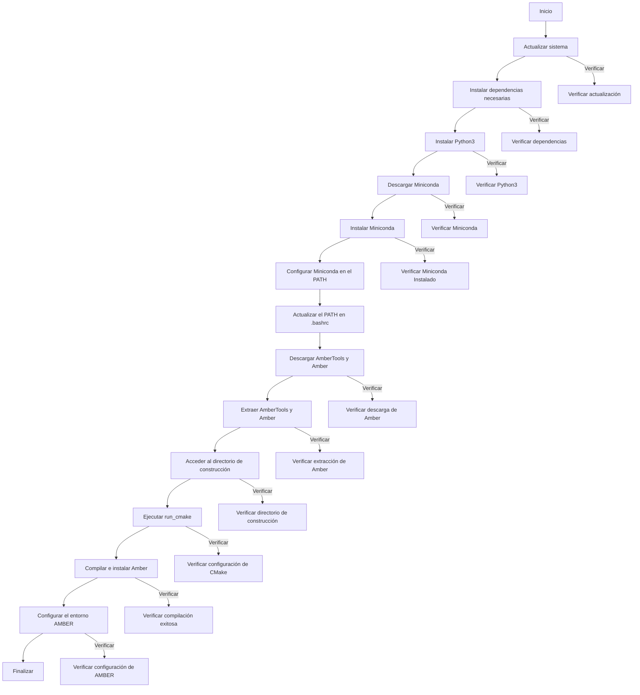

# Instalación y Configuración de AMBER en UBUNTU

Este documento describe el proceso para configurar el entorno de AMBER en ubuntu.

## Requisitos Previos
- Conexión a internet para descargar las dependencias.
- Permisos para instalar software dentro de la maquina.

## Pasos de Instalación


### 1. Configuración Inicial

1. *Actualizar la lista de paquetes y actualizar el sistema*  
   ```bash
   apt update && apt upgrade -y || echo "Error al actualizar el sistema"
   ```

2. *Instalar dependencias necesarias para AMBER*  
   ```bash
    sudo apt -y update
    sudo apt -y install tcsh make gcc gfortran flex bison patch bc wget xorg-dev libz-dev libbz2-dev ||echo "Error al instalar dependencias"
   ```

3. *Instalar Python 3*  
   ```bash
   apt install -y python3 || echo "Error al instalar Python3"
   ```

4. *Verificación0*
   ```bash
   dpkg -l | grep -E 'tcsh|make|gcc|gfortran|flex|bison|patch|bc|wget|xorg-dev|libz-dev|libbz2-dev' && python3 --version
   ```


### 2. Instalación de Miniconda

1. *Descargar el instalador de Miniconda*  
   ```bash
   wget -q https://repo.anaconda.com/miniconda/Miniconda3-latest-Linux-x86_64.sh -O /tmp/Miniconda3-latest-Linux-x86_64.sh || echo "Error al descargar Miniconda"
   ```

2. *Instalar Miniconda de forma silenciosa*  
   ```bash
   bash /tmp/Miniconda3-latest-Linux-x86_64.sh -b -p "$HOME/miniconda" || echo "Error al instalar Miniconda"
   ```

3. *Configurar el PATH para incluir Miniconda*  
   ```bash
   export PATH="$HOME/miniconda/bin:$PATH"
   ```

3. *Actualizar PATH*  
    ```bash
    source ~/.bashrc
    ```

4. *Verificación0*
   ```bash
   $HOME/miniconda/bin/conda --version && echo $PATH | grep "$HOME/miniconda"
   ```

5. *Activar Conda*
   ```bash
      conda activate
   ```

### 3. Descarga e Instalación de AmberTools y Amber

1. *Cambiar al directorio temporal*  
   ```bash
   cd /tmp || echo "Error al acceder al directorio /tmp"
   ```

2. *Descargar AmberTools y Amber*  
   ```bash
   curl -X POST -d "Name=Juan Moromenacho" -d "Institution=UIDE" -o ambertools24.tar.bz2 https://ambermd.org/cgi-bin/AmberTools24-get.pl && curl -X POST -d "Name=Juan Moromenacho" -d "Institution=UIDE" -o amber24.tar.bz2 https://ambermd.org/cgi-bin/Amber24free-get.pl 
   ```

3. *Extraer los archivos descargados*  
   ```bash
   mkdir /home/user/Amber24 && tar xvfj ambertools24.tar.bz2 -C ~/home/Amber24 && tar xvfj amber24.tar.bz2 -C ~/home/Amber24
   tar xvfj ambertools24.tar.bz2 && tar xvfj amber24.tar.bz2 
   ```

4. *Verificación0*
   ```bash
   ls -l ambertools24.tar.bz2 amber24.tar.bz2 && ls -l ambertools24
   ```


### 4. Compilación de Amber

1. *Acceder al directorio de construcción*  
    ```bash
    cd /home/<user>/amber24_src/build || echo "Error al acceder al directorio de construcción"
    ```   

2. *Ejecutar el script de configuración*  
    ```bash
    sudo ./run_cmake || echo "Error al ejecutar run_cmake"
    ```

3. *Compilar e instalar*  
    ```bash
    sudo make install || echo "Error al ejecutar make install"
    ```

4. *Verificación*
   ```bash
   dpkg -l | grep -E 'tcsh|make|gcc|gfortran|flex|bison|patch|bc|wget|xorg-dev|libz-dev|libbz2-dev' && python3 --version
   ```


### 5. Configuración Final

1. *Configurar el entorno de AMBER*  
    ```bash
    source "$HOME/<User>/amber24/amber.sh" || echo "Error al configurar el entorno AMBER"
    ```   

## Notas

- Asegúrate de reemplazar <User> con tu nombre de usuario en el sistema.
- Este script maneja errores comunes y muestra mensajes claros en caso de fallas.

# Diagrama del proceso AMBER en HPC CEDIA

Este diagrama describe los pasos para la configuración del entorno y la instalación de AMBER.


###   Referencias
>  [!Generic_installation_instructions]
>  [Installing Amber on Ubuntu](https://ambermd.org/InstUbuntu.php).